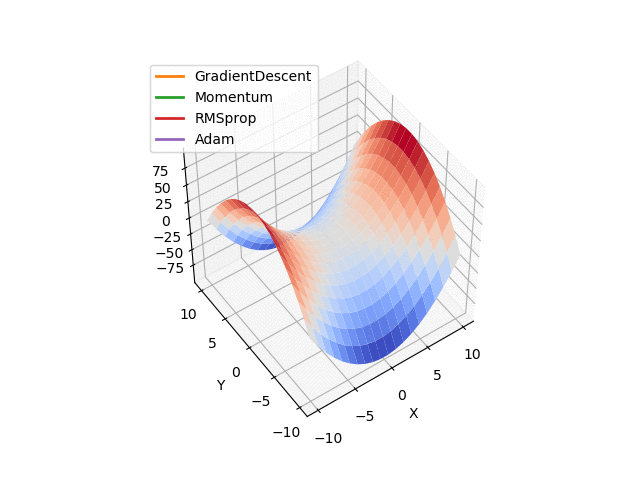

# optimization_methods
Optimization Methods

# Structure

_optimization_functions.py_: Contains the functions where the optimizers will be tested.

_optimization_methods.py_: Contains the optimizers.

_visualization_utils.py_: Contains utilities to visualize in 2d/3d contours, surfaces, and progress of optimization.

_runme_animate_plot.py_: Displays the 2d/3d animation and saves the figures. 

# 2D Animation

# 3D Animation
Note that there's a problem when showing the optimizers. It doesn't happens with the animation of matplotlib. 

NOTE: I'm still not convinced that they are correctly programmed. SGD works better than any of the other 3, which is weird....